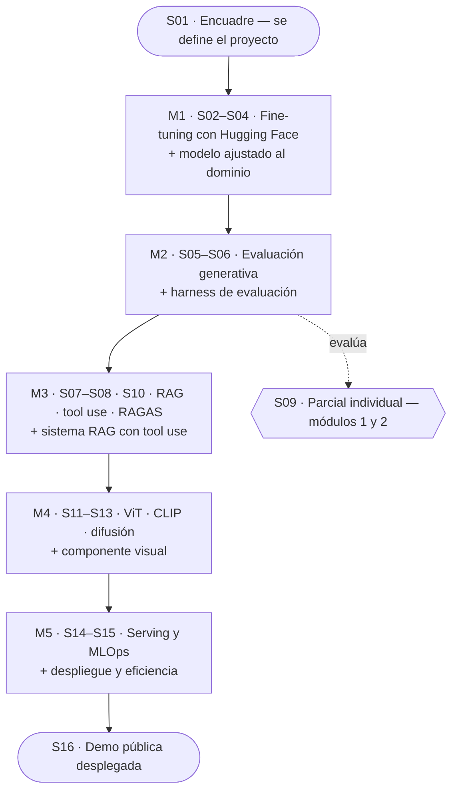

<div align="center">

# SI4006 · Tópicos Especiales y Aplicaciones en IA

Curso electivo de la Universidad EAFIT: 16 sesiones construyendo, en equipo, un sistema de IA generativa desplegado.


[](https://colab.research.google.com/github/manularrea/EAFIT-SI4006/blob/main/sesiones/s01/S01_Demo_Capacidades.ipynb)
[](https://github.com/manularrea/EAFIT-SI4006/actions/workflows/ci.yml)

**[Cómo usar](#cómo-usar-este-repositorio) · [Mapa del semestre](#mapa-del-semestre) · [Sesiones](#sesiones) · [Evaluación](#evaluación) · [Proyecto](#proyecto-integrador) · [Setup](#entorno-y-setup) · [Contacto](#contacto)**

</div>

---

## Qué es este curso

Electiva de séptimo semestre (3 créditos) sobre IA generativa aplicada. A lo
largo de 16 sesiones de 3 horas, cada equipo lleva un proyecto desde la
definición del problema hasta una demo pública desplegada, pasando por
fine-tuning, evaluación rigurosa, RAG, multimodalidad y serving eficiente. No
hay examen final: el cierre es la demo.

## Cómo usar este repositorio

La ruta del estudiante, en tres pasos:

1. **Abre la sesión** en [`sesiones/`](sesiones/) y lee su `README`.
2. **Haz clic en el badge de Colab** del notebook de la sesión.
3. **Activa la GPU** en Colab (`Entorno de ejecución` → `Cambiar tipo` → GPU T4)
   y corre primero la celda de instalación.

Detalle completo en [recursos/setup-colab.md](recursos/setup-colab.md).

## Mapa del semestre

Los cinco módulos no son temas sueltos: cada uno apila una capa sobre el mismo
proyecto, que converge en una demo desplegada.



## Sesiones

| # | Módulo | Tema | Material | Colab |
|:--:|:--:|------|:--:|:--:|
| 01 | Encuadre | Encuadre y demo de capacidades | [Ver](sesiones/s01/) | [](https://colab.research.google.com/github/manularrea/EAFIT-SI4006/blob/main/sesiones/s01/S01_Demo_Capacidades.ipynb) |
| 02 | M1 | Transformers y fine-tuning con Hugging Face | [Ver](sesiones/s02/) | [](https://colab.research.google.com/github/manularrea/EAFIT-SI4006/blob/main/sesiones/s02/S02_Lab_Abrir_la_caja.ipynb) |
| 03 | M1 | Transformers y fine-tuning con Hugging Face | [Ver](sesiones/s03/) | [](https://colab.research.google.com/github/manularrea/EAFIT-SI4006/blob/main/sesiones/s03/S03_Lab_El_bloque_y_las_familias.ipynb)|
| 04 | M1 | Transformers y fine-tuning con Hugging Face | [Ver](sesiones/s04/) | [](https://colab.research.google.com/github/manularrea/EAFIT-SI4006/blob/main/sesiones/s04/S04_Lab_Fine_tuning.ipynb) |
| 05 | M2 | Evaluación de sistemas generativos | [Ver](sesiones/s05/) | [](https://colab.research.google.com/github/manularrea/EAFIT-SI4006/blob/main/sesiones/s05/S05_Lab_Metricas_de_evaluacion.ipynb) |
| 06 | M2 | Evaluación de sistemas generativos | [Ver](sesiones/s06/) | [](https://colab.research.google.com/github/manularrea/EAFIT-SI4006/blob/main/sesiones/s06/S06_Lab_Harness_de_evaluacion_SOLUCIONES.ipynb) |
| 07 | M3 | RAG, agentes, tool use, RAGAS | [Ver](sesiones/s07/) | [](https://colab.research.google.com/github/manularrea/EAFIT-SI4006/blob/main/sesiones/s07/S07_Lab_RAG_ingenuo.ipynb) |
| 08 | M3 | RAG, agentes, tool use, RAGAS | [Ver](sesiones/s08/) | [](https://colab.research.google.com/github/manularrea/EAFIT-SI4006/blob/main/sesiones/s08/S08_Lab_RAG_avanzado.ipynb) |
| 09 | Parcial | Parcial individual (módulos 1 y 2) | [Ver](sesiones/s09/) | — |
| 10 | M3 | RAG, agentes, tool use, RAGAS | [Ver](sesiones/s10/) | [](https://colab.research.google.com/github/manularrea/EAFIT-SI4006/blob/main/sesiones/s10/S10_Lab_Agentic_RAG_RAGAS.ipynb)  |
| 11 | M4 | ViT, CLIP, multimodales, difusión | [Ver](sesiones/s11/) | - |
| 12 | M4 | ViT, CLIP, multimodales, difusión | [Ver](sesiones/s12/) | — |
| 13 | M4 | ViT, CLIP, multimodales, difusión | [Ver](sesiones/s13/) | — |
| 14 | M5 | Destilación, quantization, serving, MLOps | [Ver](sesiones/s14/) | — |
| 15 | M5 | Destilación, quantization, serving, MLOps | [Ver](sesiones/s15/) | — |
| 16 | Cierre | Demos finales | [Ver](sesiones/s16/) | — |

Índice también en [sesiones/README.md](sesiones/README.md). El guion (—) en Colab
indica que el notebook de esa sesión aún no está publicado.

## Evaluación

Sin examen final. La nota se reparte entre los entregables del proyecto y un
parcial individual.

| Ítem | Sesión | Peso |
|------|:--:|:--:|
| M1 — Fine-tuning baseline + dataset | S04 | 10% |
| M2 — Harness de evaluación + scorecard | S06 | 10% |
| Parcial individual (módulos 1 y 2) | S09 | 15% |
| M3 — Sistema RAG + evaluación RAGAS | S10 | 15% |
| M4 — Pipeline multimodal + casos de prueba | S13 | 10% |
| Proyecto final — demo desplegada + presentación + reporte (Nota: Penalizacion por inasistencia)  | S16 | 30% |
| Asistencia | S16 | 10% |
| **Total** | | **100%** |

## Proyecto integrador

Hilo conductor del curso: un proyecto en equipos de 4-5 personas que crece
módulo a módulo hasta una demo pública desplegada. Arranca en la Sesión 1 con la
definición del problema y el usuario.

Empieza por la [plantilla de definición](proyecto/plantilla-definicion.md).

## Entorno y setup

<details>
<summary>Colab (ruta principal) y setup local</summary>

<br>

**Colab** es la ruta principal: no necesitas instalar nada. Cada notebook abre
en Colab desde su badge y corre en la GPU gratuita T4. Ver
[recursos/setup-colab.md](recursos/setup-colab.md).

**Local** (secundario) — si prefieres tu máquina:

```bash
python -m venv .venv && source .venv/bin/activate
pip install -r requirements.txt
```

Las versiones de [`requirements.txt`](requirements.txt) están fijadas a
propósito: `transformers==4.49.0` es el piso para Qwen2.5 y SmolVLM con el
pipeline `image-text-to-text`. No las cambies.

**Stack:** Python · PyTorch · Hugging Face (transformers, sentence-transformers)
· Google Colab (T4) · Chroma · RAGAS · Weights & Biases · Gradio/Streamlit ·
Hugging Face Spaces.

</details>

## Política de uso de IA

Las herramientas de inteligencia artificial están para usarse. Como estudiantes, pueden apoyarse en soluciones como ChatGPT, Claude, Gemini u otras herramientas similares para desarrollar sus actividades y proyectos.
Sin embargo, su uso no reemplaza la comprensión de los conceptos ni el criterio profesional. Cada estudiante debe estar en capacidad de explicar, justificar y defender las decisiones tomadas en su trabajo.
Toda información generada con apoyo de inteligencia artificial debe ser revisada, contrastada y validada con fuentes confiables. Durante las sustentaciones, ustedes serán responsables de la precisión de la información presentada. Si una respuesta, afirmación o decisión es incorrecta, la responsabilidad no será de la herramienta utilizada, sino de quien decidió incorporarla sin verificarla.
El objetivo no es evitar el uso de la inteligencia artificial, sino aprender a utilizarla de manera crítica, responsable y consciente.

## Contacto

- **Docente:** Manuela Larrea Gómez — [mlarreag@eafit.edu.co](mailto:mlarreag@eafit.edu.co)
- **Canal oficial del curso:** Microsoft Teams

Para erratas o notebooks que no corren, abre un [issue](https://github.com/manularrea/EAFIT-SI4006/issues); para dudas
administrativas y de entregas, usa Teams.

## Licencia

Licencia dual: el **código** se distribuye bajo [MIT](LICENSE) —reutilízalo
libremente—; el **material docente** (diapositivas, guiones, enunciados) bajo
[CC BY-NC-SA 4.0](LICENSE-CONTENIDO.md) —se comparte con atribución, pero no se
comercializa.
